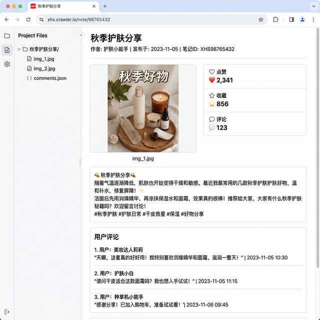

# 小红书爬虫工具

一个功能完整的小红书笔记爬虫工具，支持关键词搜索、主页推荐、博主主页爬取，具有图形化界面。


### 应用界面


## 功能特点

- **多种爬取模式**：标准模式（完整数据）、极速模式（快速采集）
- **多种爬取类型**：关键词搜索、主页推荐、博主主页
- **完整数据采集**：标题、作者、正文、标签、发布时间、IP地区、互动数据
- **媒体下载**：图片批量下载、视频下载、评论图片单独存储
- **智能过滤**：表情包过滤、Live图去重（只保留一张）
- **数据导出**：Excel导出、SQLite数据库存储
- **图形化界面**：斑马纹表格、搜索筛选、排序、数据统计、图片预览
- **配置持久化**：自动保存上次设置

## 环境要求

- Python 3.8+
- Windows 10/11

## 安装依赖

```bash
pip install -r requirements.txt
```

主要依赖：
- DrissionPage - 浏览器自动化
- pandas - 数据处理
- openpyxl - Excel导出
- Pillow - 图片处理
- jieba - 中文分词（词云）

## 使用方法

```bash
python crawler_ultimate.py
```

## 目录结构

```
redbooks/
├── crawler_ultimate.py    # 主程序
├── requirements.txt       # 依赖列表
├── README.md             # 说明文档
├── data/                 # 数据目录
│   ├── settings.json     # 配置文件
│   └── xiaohongshu.db    # SQLite数据库
├── images/               # 图片保存目录
│   └── 关键词_时间/
│       └── note_1_xxx/
│           ├── img_1.jpg
│           ├── video.mp4
│           └── comments/
│               └── comment_img_1.jpg
└── docs/                 # 文档目录
    ├── 功能说明文档.md
    ├── 小红书页面结构分析.md
    └── 爬取流程模拟分析.md
```

## 功能说明

### 爬取模式

| 模式 | 说明 | 适用场景 |
|------|------|----------|
| 标准模式 | 点击笔记进入详情页提取完整数据 | 需要完整内容、评论、互动数据 |
| 极速模式 | 仅从列表页提取基础信息 | 快速批量采集封面图 |

### 爬取类型

- **关键词搜索**：搜索指定关键词的笔记
- **主页推荐**：爬取首页推荐内容
- **博主主页**：爬取指定博主的全部笔记

### 数据字段

| 字段 | 说明 |
|------|------|
| title | 标题 |
| author | 作者 |
| content | 正文内容 |
| tags | 标签 |
| publish_time | 发布时间 |
| ip_region | IP地区 |
| like_count | 点赞数 |
| collect_count | 收藏数 |
| comment_count | 评论数 |
| image_urls | 图片链接 |
| video_url | 视频链接 |
| comments | 评论列表 |

### GUI功能

- 斑马纹表格（奇偶行交替颜色）
- 类型颜色区分（图文蓝色、视频橙色）
- 点击表头排序
- 搜索筛选（关键词+类型）
- 统计卡片（总计、图文数、视频数、总点赞）
- 右键菜单（复制、打开原文、删除）
- 图片预览（分页、评论图片蓝色边框标记）

## 配置说明

配置保存在 `data/settings.json`，程序正常关闭时自动保存。

**注意**：必须通过点击窗口X按钮正常关闭程序，设置才会保存。

## 注意事项

1. 首次使用需要登录小红书账号
2. 建议适当设置爬取间隔，避免被限制
3. 遵守小红书的服务条款和robots.txt
4. 仅供学习研究使用

## 更新日志

### 2026-02-02
- 修复数据缓存问题（使用URL中的noteId）
- 添加Live图过滤（只保留一张）
- 添加评论图片单独存储
- 优化GUI界面（斑马纹、排序、筛选、统计卡片）
- 添加配置持久化功能


### 笔记详情与数据采集

自动采集笔记正文、图片、评论等数据，按目录结构保存。



## License

MIT License
